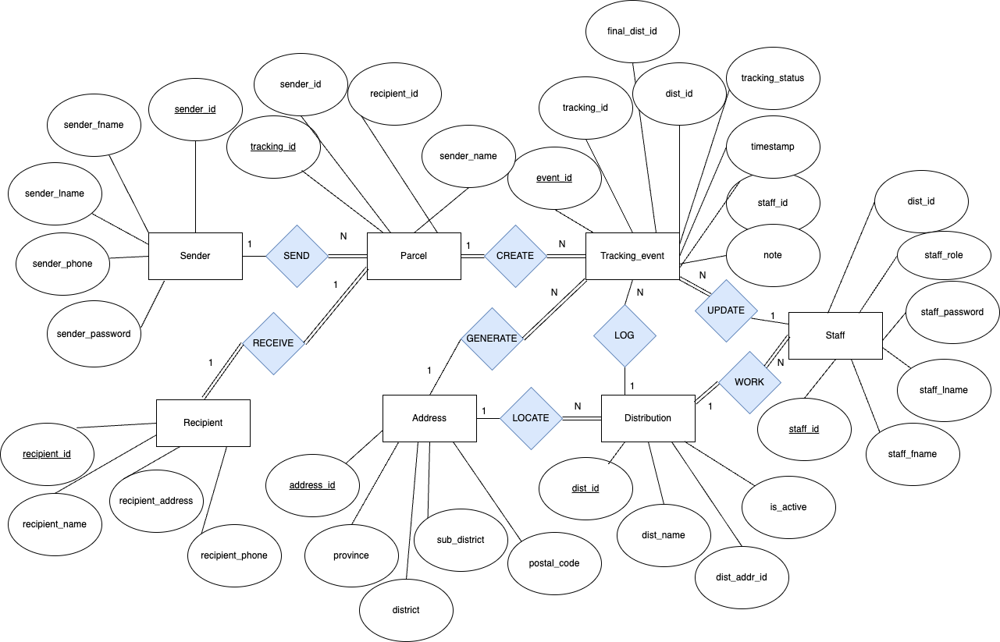
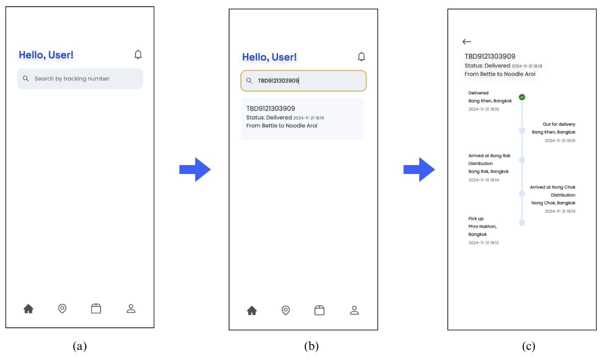

# TrackBuddy – Parcel Delivery Tracking System

## Description
TrackBuddy is a relational database system designed to track parcels across multiple distribution centers. It includes role-specific interfaces for Senders, Recipients, Staff, Couriers, and Admins.  

## Features
- Track parcels with real-time status updates (mockup data).  
- User registration and authentication.  
- Admin dashboard for staff management and parcel monitoring.  
- Database diagrams (ER, context, and data flow) created with Draw.io.

## Technologies
SQL, Draw.io, Figma

## Screenshots
**ER Diagram**  

**Example User Interface flow**  

## Documentation
- [Assignment Report](trackbuddy_report.pdf) – Detailed project report submitted for academic evaluation (optional to view).
